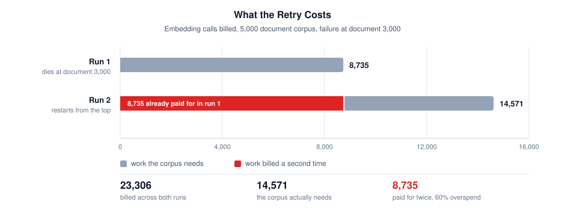

# 🔁 Durable RAG Ingestion with Inngest

Build a document ingestion pipeline that **survives partial failures, re-runs and backfills**.

Most RAG tutorials assume your documents made it into the index. This one is about what happens
when they do not: a run over thousands of documents that dies two thirds of the way through, and a
retry that re-parses and re-embeds everything it already paid for.

Every number in that chart comes from section 4 of the notebook, which you can run with no API key
and no account.

## 🎯 What You'll Learn

- **What Inngest actually is**, from the events-functions-steps model up, in section 6. No prior
  knowledge of it assumed
- **What a failed run actually costs.** You run the naive pipeline, kill it at document 3,000 of
  5,000, retry it, and count the wasted embedding calls and the duplicate chunks yourself
- **Durable steps**: wrapping each stage in `step.run()` so a retry resumes at the document that
  failed instead of at document one
- **Idempotent upserts** keyed on document ID plus content hash, so re-ingesting the same file
  updates in place rather than adding a second copy
- **Fan-out per document**, so one unparseable file fails on its own instead of taking the run down,
  and when `step.invoke` is the better tool than an event
- **Flow control**: throttling and per-tenant concurrency, so a historical backfill does not starve
  live ingestion
- **A human review gate** with `step.wait_for_event()` for documents that fail parsing
- **When you do not need any of this**, which is a real answer for a lot of pipelines

## 📓 Tutorial

[durable_rag_ingestion_tutorial.ipynb](durable_rag_ingestion_tutorial.ipynb)

## 🚀 Run in Google Colab

Sections 1 to 5 run anywhere, Colab included, with no API key and no account. They are the part
that shows the cost. Sections 7 onward run the real pipeline and need the local Inngest dev server,
which is a single command and also free.

## 📋 Requirements

- **Python 3.10+**
- **No API key.** Embeddings are a deterministic local stand-in so the numbers are reproducible and
  nobody has to pay to read a tutorial. Swapping in a real embedding model is one function.
- **Node.js**, only for sections 7 onward, to run `npx inngest-cli@latest dev`
- `pip install -r requirements.txt`

## 🎓 What You'll Build

An ingestion pipeline that fetches, parses, chunks, embeds and upserts a 5,000 document corpus,
and then keeps its place when things go wrong:

- A failure at document 3,000 costs you the remaining 2,000, not all 5,000
- Re-running the whole pipeline over an unchanged corpus adds zero duplicate chunks
- One malformed document fails alone and lands in a review queue
- A backfill runs at a throttled rate without starving live ingestion
- You fix a parser bug and replay one step against one document

**Total Tutorial Time**: ~45 minutes
**Difficulty**: Intermediate (Python, basic RAG concepts, no prior Inngest knowledge assumed)

## 🙏 Sponsor

This tutorial was sponsored by **[Inngest](https://europe-west1-atp-views-tracker.cloudfunctions.net/working-analytics?notebook=tutorials--durable-rag-ingestion-inngest--readme&click=inngest-home&target=https%3A%2F%2Fwww.inngest.com%2F%3Futm_source%3Ddiamantai%26utm_medium%3Dgithub%26utm_campaign%3Ddurable-rag-ingestion&text=Inngest)**, the
durable execution platform used throughout. The architecture, the tradeoffs and the section on when
not to use it are the author's own. All code runs, so you can check every claim in it.

[Inngest docs](https://europe-west1-atp-views-tracker.cloudfunctions.net/working-analytics?notebook=tutorials--durable-rag-ingestion-inngest--readme&click=inngest-docs&target=https%3A%2F%2Fwww.inngest.com%2Fdocs%3Futm_source%3Ddiamantai%26utm_medium%3Dgithub%26utm_campaign%3Ddurable-rag-ingestion&text=Inngest%20docs)
