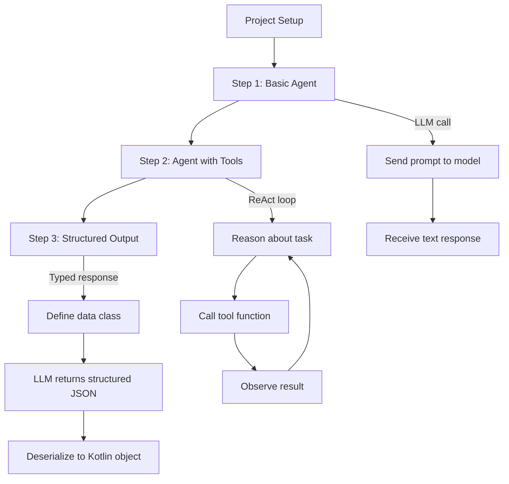
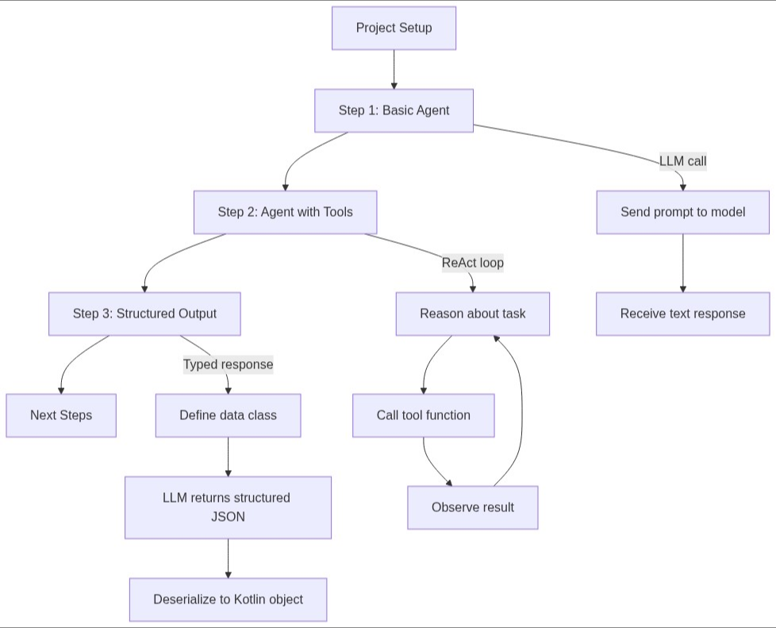
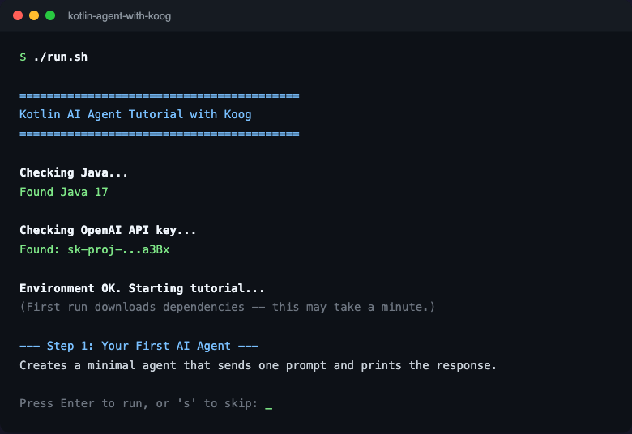
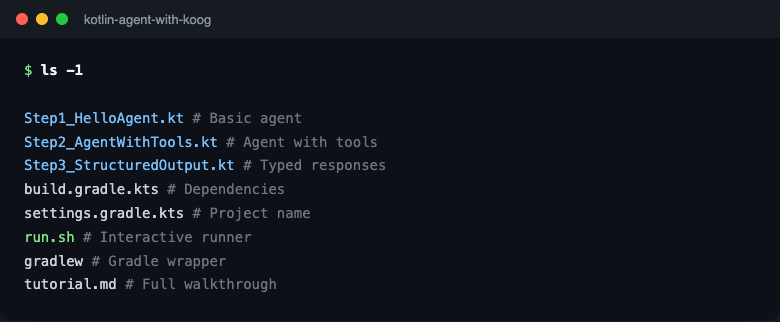
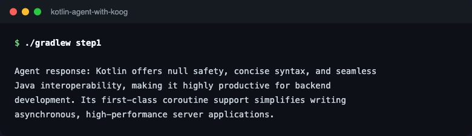
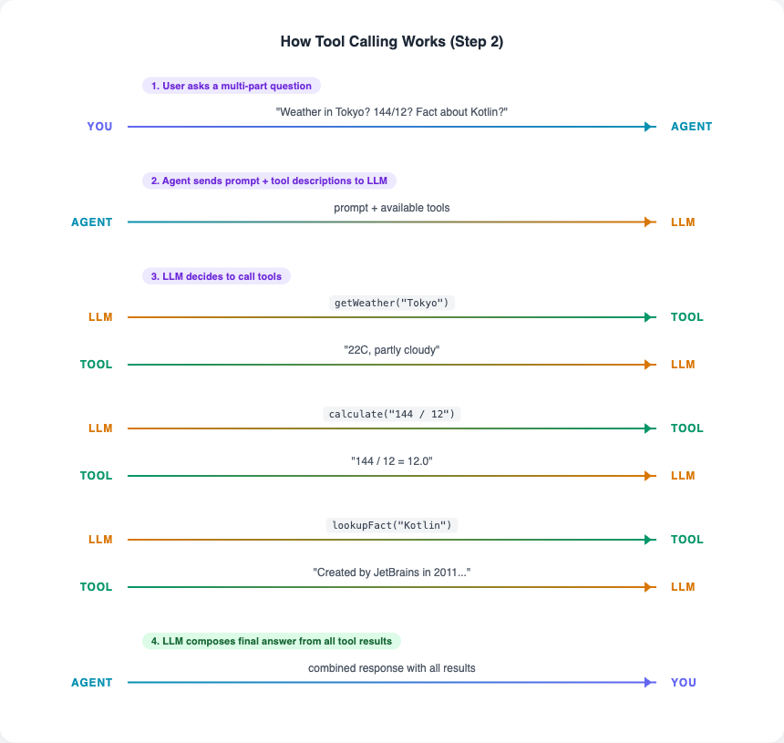
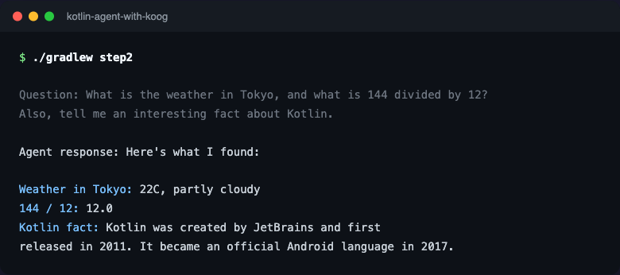
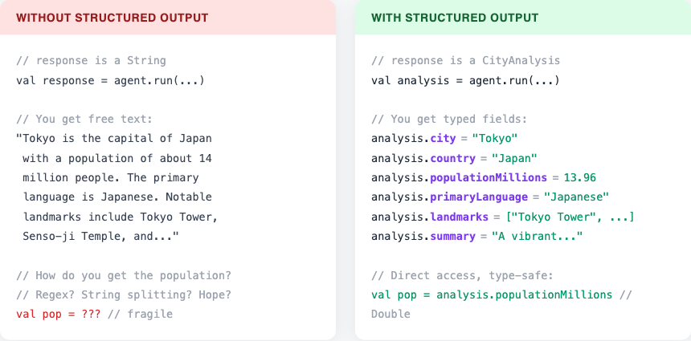
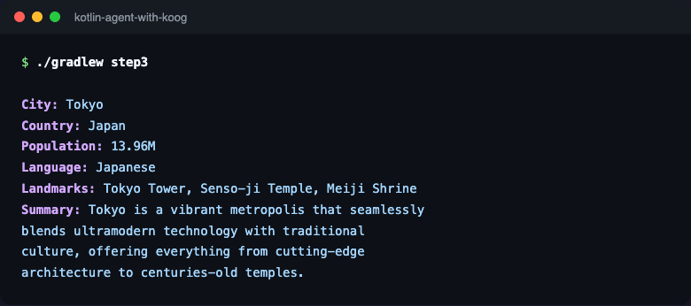

# Building AI Agents in Kotlin with Koog

Kotlin powers a significant portion of backend infrastructure across the JVM ecosystem, yet most AI agent tutorials target Python exclusively. This tutorial bridges that gap using Koog, JetBrains' open-source framework for building LLM-powered agents in Kotlin. By the end, you will have built an agent that can reason about tasks, call tools autonomously, and return typed Kotlin objects instead of raw text.

The tutorial progresses through three self-contained steps. You will start with a minimal agent that sends a single prompt to an LLM, then extend it with custom tools that the agent invokes on its own, and finally configure structured output so the LLM returns data as a Kotlin data class you can work with directly in code.



<details>
<summary>Diagram not rendering? Click to see the image version.</summary>



</details>

---

## Prerequisites and Project Setup

Before writing any agent code, you need two things:

1. **JDK 17 or later.** Check with `java -version`. If you need to install one:
   - macOS: `brew install openjdk@17`
   - Ubuntu/Debian: `sudo apt install openjdk-17-jdk`
   - Any platform: download from [Adoptium](https://adoptium.net/temurin/releases/)

2. **An OpenAI API key.** Get one at [platform.openai.com/api-keys](https://platform.openai.com/api-keys). Set it as an environment variable:

```bash
export OPENAI_API_KEY="sk-..."
```

### Getting the Project

If you cloned this repository, the tutorial directory already contains a working Gradle project with the wrapper included. Just navigate to it:

```bash
cd tutorials/kotlin-agent-with-koog
```

No need to install Gradle -- the included `gradlew` script downloads it automatically. If you prefer a guided experience, run the interactive script:

```bash
./run.sh
```

It checks your environment, prompts for your API key if needed, and walks you through each step interactively.



### Project Structure

All files live at the tutorial root -- no nested directories to navigate:



### Understanding the Build File

Below is a walkthrough of the `build.gradle.kts` so you understand what each dependency does. This single file declares the Koog agent framework, Kotlin coroutines for async execution, and Kotlin serialization for structured output in Step 3. The `sourceSets` block at the bottom tells Gradle to look for Kotlin files in the project root rather than the conventional `src/main/kotlin` hierarchy, keeping the tutorial flat and easy to navigate.

```kotlin
plugins {
    kotlin("jvm") version "2.1.0"
    kotlin("plugin.serialization") version "2.1.0"
}

repositories {
    mavenCentral()
}

dependencies {
    // Koog AI agent framework by JetBrains
    implementation("ai.koog:koog-agents:0.6.2")

    // Kotlin coroutines (required for suspend-based agent execution)
    implementation("org.jetbrains.kotlinx:kotlinx-coroutines-core:1.10.1")

    // Kotlin serialization (required for structured output and tool definitions)
    implementation("org.jetbrains.kotlinx:kotlinx-serialization-json:1.8.0")

    // SLF4J no-op logger to suppress logging noise in tutorial output
    implementation("org.slf4j:slf4j-nop:2.0.16")
}

// Allow running each step file individually:
//   ./gradlew step1  ->  runs Step1_HelloAgent.kt
//   ./gradlew step2  ->  runs Step2_AgentWithTools.kt
//   ./gradlew step3  ->  runs Step3_StructuredOutput.kt

tasks.register<JavaExec>("step1") {
    group = "tutorial"
    description = "Run Step 1: Hello Agent"
    mainClass.set("Step1_HelloAgentKt")
    classpath = sourceSets["main"].runtimeClasspath
}

tasks.register<JavaExec>("step2") {
    group = "tutorial"
    description = "Run Step 2: Agent with Tools"
    mainClass.set("Step2_AgentWithToolsKt")
    classpath = sourceSets["main"].runtimeClasspath
}

tasks.register<JavaExec>("step3") {
    group = "tutorial"
    description = "Run Step 3: Structured Output"
    mainClass.set("Step3_StructuredOutputKt")
    classpath = sourceSets["main"].runtimeClasspath
}

// Place Kotlin source files at the tutorial root instead of src/main/kotlin
sourceSets {
    main {
        kotlin {
            setSrcDirs(listOf("."))
        }
    }
}

kotlin {
    jvmToolchain(17)
}
```

You also need a minimal `settings.gradle.kts`:

```kotlin
rootProject.name = "kotlin-agent-with-koog"
```

Verify everything compiles before moving on:

```bash
./gradlew build
```

The first run downloads Gradle itself plus all dependencies. This takes about a minute and only happens once. If it succeeds without errors, your project is ready.

---

## Step 1: Your First AI Agent

An AI agent in Koog is a configured object that manages the lifecycle of sending prompts to a large language model and processing its responses. At its simplest, an agent takes a text input, forwards it to the LLM with an optional system prompt, and returns the model's text response. This is the foundation that the more advanced patterns in Steps 2 and 3 build upon.

### Creating and Running a Basic Agent

The code below creates an executor (the component responsible for communicating with OpenAI's API), configures an agent with a system prompt that encourages concise answers, sends a single question, and prints the response.

A few Kotlin patterns to note if you are coming from Python or JavaScript:

- `suspend fun main()` is like Python's `async def main()`. Koog's agent runs on coroutines, so the entry point must be suspendable.
- `.use { ... }` is like Python's `with` statement. It automatically closes the HTTP connection when the block finishes.
- `?:` (the "Elvis operator") provides a fallback when a value is null, similar to `or` in Python.

```kotlin
// Step1_HelloAgent.kt

import ai.koog.agents.core.agent.AIAgent
import ai.koog.prompt.executor.clients.openai.OpenAIModels
import ai.koog.prompt.executor.llms.all.simpleOpenAIExecutor

// "suspend fun main()" is Kotlin's way of writing an async main function.
// If you come from Python, think of it like:  async def main()
// Koog agents run on coroutines, so the entry point must be suspendable.
suspend fun main() {

    // Read the API key from an environment variable.
    // The "?:" operator (called "Elvis") provides a fallback if the value is null.
    // In Python terms:  api_key = os.environ.get("OPENAI_API_KEY") or raise ...
    val apiKey = System.getenv("OPENAI_API_KEY")
        ?: error("Set the OPENAI_API_KEY environment variable before running this example.")

    // Create an executor -- the HTTP client that talks to OpenAI's API.
    // ".use { ... }" automatically closes the connection when the block finishes,
    // similar to Python's "with open(...) as f:" pattern.
    simpleOpenAIExecutor(apiKey).use { executor ->

        // Build the agent. At minimum, it needs:
        //   - an executor (how to reach the LLM)
        //   - a model (which LLM to use)
        //   - a system prompt (the agent's personality / instructions)
        val agent = AIAgent(
            promptExecutor = executor,
            llmModel = OpenAIModels.Chat.GPT4oMini,
            systemPrompt = "You are a concise assistant. Answer in one or two sentences.",
        )

        // Send a prompt and get a text response back.
        val response = agent.run("What makes Kotlin a good language for backend development?")
        println("Agent response: $response")
    }
}
```

Run it with:

```bash
./gradlew step1
```

You should see output similar to this:



The exact wording will vary because LLM responses are non-deterministic. What matters is that you got a coherent response back. Under the hood, the executor serialized your prompt into an OpenAI API request, sent it over HTTPS, and returned the text content. The agent used its default `singleRunStrategy` -- one request, one response, done.

**Try it yourself:** Open `Step1_HelloAgent.kt` and change the prompt to ask about something you are curious about. Change the system prompt to make the agent respond in a different style (e.g., "Explain like I'm five" or "Answer as a pirate"). Re-run with `./gradlew step1` to see the difference.

---

## Step 2: Adding Tools to the Agent

A basic agent that only sends prompts is limited to the knowledge baked into the LLM. Real-world agents need to interact with external systems: querying databases, calling APIs, performing calculations. This is where tools come in.

When you give an agent tools, the LLM receives descriptions of the available functions alongside the user's question. Instead of guessing at an answer, the model can decide to call one or more of these functions, inspect the results, and then formulate a final response based on real data. This cycle of reasoning about what to do, taking an action, and observing the outcome is known as the ReAct pattern (Reason, Act, Observe). Here is what that looks like for the question we will ask in this step:



### Defining Tools with Annotations

Koog uses an annotation-based API for tool definitions. You create a class that implements the `ToolSet` interface, and annotate each function you want to expose with `@Tool`. The `@LLMDescription` annotation provides a natural-language description that the model reads to understand what the tool does and when to use it. Parameter-level descriptions help the model provide correct arguments.

```kotlin
// Step2_AgentWithTools.kt (tool definitions)

import ai.koog.agents.core.tools.annotations.LLMDescription
import ai.koog.agents.core.tools.annotations.Tool
import ai.koog.agents.core.tools.reflect.ToolSet

// A ToolSet is a class whose methods can be called by the LLM.
// Think of it like defining "functions" that an AI assistant can use.
//
// @Tool           -- marks a function as callable by the agent
// @LLMDescription -- tells the LLM what the function (or parameter) does,
//                    so it knows WHEN and HOW to call it

@LLMDescription("Tools for looking up weather, performing calculations, and retrieving facts")
class AssistantTools : ToolSet {

    @Tool
    @LLMDescription("Get the current weather for a given city. Returns temperature and conditions.")
    fun getWeather(@LLMDescription("City name, e.g. 'Tokyo'") city: String): String {
        // In a real app, this would call a weather API.
        // We use hardcoded data so the tutorial works without extra API keys.
        val data = mapOf(
            "tokyo" to "22C, partly cloudy",
            "london" to "14C, rainy",
            "new york" to "28C, sunny",
            "sydney" to "18C, clear skies",
        )
        return data[city.lowercase()] ?: "25C, clear (default forecast)"
    }

    @Tool
    @LLMDescription("Evaluate a basic arithmetic expression and return the numeric result.")
    fun calculate(@LLMDescription("Arithmetic expression, e.g. '144 / 12'") expression: String): String {
        val result = evaluateExpression(expression)
        return "$expression = $result"
    }

    @Tool
    @LLMDescription("Look up a factual piece of information about a topic.")
    fun lookupFact(@LLMDescription("Topic to look up, e.g. 'Kotlin'") topic: String): String {
        val facts = mapOf(
            "kotlin" to "Kotlin was created by JetBrains and first released in 2011. ...",
            "koog" to "Koog is an open-source AI agent framework by JetBrains. ...",
        )
        return facts[topic.lowercase()] ?: "No specific fact found for '$topic'."
    }

    private fun evaluateExpression(expr: String): Double { /* ... */ }
}
```

These tools use simulated data so the tutorial runs without external API dependencies. In a production agent, each tool function would call a real service -- the pattern is exactly the same, just swap the body of each function.

### Configuring the Agent with a Tool Registry

To make tools available to the agent, you register them through a `ToolRegistry`. The `.asTools()` extension function converts your annotated `ToolSet` class into the internal tool format that Koog understands. Once the registry is passed to the agent constructor, the LLM will see these tools in every request and can decide when to invoke them.

```kotlin
// Step2_AgentWithTools.kt (agent configuration)

import ai.koog.agents.core.agent.AIAgent
import ai.koog.agents.core.tools.ToolRegistry
import ai.koog.agents.core.tools.reflect.asTools
import ai.koog.prompt.executor.clients.openai.OpenAIModels
import ai.koog.prompt.executor.llms.all.simpleOpenAIExecutor

suspend fun main() {
    val apiKey = System.getenv("OPENAI_API_KEY")
        ?: error("Set the OPENAI_API_KEY environment variable before running this example.")

    // Register the tools so the agent can discover and call them.
    // .asTools() converts the annotated ToolSet class into Koog's internal format.
    val toolRegistry = ToolRegistry {
        tools(AssistantTools().asTools())
    }

    simpleOpenAIExecutor(apiKey).use { executor ->
        val agent = AIAgent(
            promptExecutor = executor,
            llmModel = OpenAIModels.Chat.GPT4oMini,
            systemPrompt = """
                You are a helpful assistant with access to tools for weather, calculations, and fact lookup.
                When asked a question, use the appropriate tools to find the answer.
                Always use tools when they are relevant rather than guessing.
            """.trimIndent(),
            // Pass the tool registry -- without this, the agent has no tools.
            toolRegistry = toolRegistry,
        )

        // Ask a multi-part question that forces the agent to use all three tools.
        val question = "What is the weather in Tokyo, and what is 144 divided by 12? " +
            "Also, tell me an interesting fact about Kotlin."
        println("Question: $question\n")

        // The agent will automatically:
        //   1. Read the question
        //   2. Decide which tools to call (getWeather, calculate, lookupFact)
        //   3. Call each tool and read the results
        //   4. Compose a final answer from the tool outputs
        val response = agent.run(question)
        println("Agent response: $response")
    }
}
```

Run it with:

```bash
./gradlew step2
```

You should see output similar to this:



Notice how the agent combined results from all three tools into a single coherent response. It decided on its own which tools to call, what arguments to pass, and how to present the results. The entire tool-calling cycle happened automatically within the framework.

**Try it yourself:** Add a fourth tool to the `AssistantTools` class. For example, a `translateWord` tool that returns hardcoded translations for a few words. Give it `@Tool` and `@LLMDescription` annotations, re-run, and ask the agent something that would require translation. Watch it discover and use your new tool without any other code changes.

---

## Step 3: Structured Output

Free-text responses work well for conversational interfaces, but production systems often need data they can parse and process programmatically. If your agent is part of a larger pipeline -- feeding data into a dashboard, triggering downstream actions, or populating a database -- you need typed, structured responses rather than prose. The difference is stark:



Koog supports structured output by combining Kotlin's serialization framework with a custom agent strategy. You define a `@Serializable` data class that describes the shape of the response you want, annotate each field with `@LLMDescription` so the model understands what to fill in, and configure the agent to use a structured output strategy that returns your data class directly.

### Defining the Response Schema

The `@Serializable` and `@SerialName` annotations come from `kotlinx.serialization` and tell the framework how to serialize and deserialize the class. The `@LLMDescription` annotations come from Koog and are sent to the model as part of the schema, so it knows what each field represents. Together, they create a contract: the model produces JSON matching this structure, and Koog deserializes it into a Kotlin object.

```kotlin
// Step3_StructuredOutput.kt (data class)

import ai.koog.agents.core.tools.annotations.LLMDescription
import kotlinx.serialization.SerialName
import kotlinx.serialization.Serializable

// Instead of getting free text like "Tokyo is the capital of Japan...",
// the LLM will return a JSON object that Koog deserializes into this class.
// You then access fields directly: analysis.city, analysis.populationMillions, etc.
//
// @Serializable       -- required by Kotlin serialization (handles JSON conversion)
// @SerialName("...")   -- the name sent to the LLM in the schema
// @LLMDescription      -- tells the LLM what each field means (on a class or property)
// @property:LLMDescription -- same, but the "property:" prefix is needed for
//                            data class constructor parameters (a Kotlin quirk)

@Serializable
@SerialName("CityAnalysis")
@LLMDescription("An analysis of a city covering key facts and livability")
data class CityAnalysis(
    @property:LLMDescription("Name of the city")
    val city: String,

    @property:LLMDescription("Country where the city is located")
    val country: String,

    @property:LLMDescription("Approximate population in millions")
    val populationMillions: Double,

    @property:LLMDescription("The city's primary language")
    val primaryLanguage: String,

    @property:LLMDescription("Three notable landmarks or attractions")
    val landmarks: List<String>,

    @property:LLMDescription("A short summary of the city's character in one or two sentences")
    val summary: String,
)
```

Note the `@property:LLMDescription` syntax. In Kotlin data classes, annotations on constructor parameters need the `property:` use-site target to be applied to the property rather than the constructor parameter itself. This is a Kotlin-specific detail that matters for Koog's reflection-based schema generation.

### Configuring the Structured Output Strategy

Unlike the previous steps that used the default strategy, structured output requires a custom strategy graph. The `nodeLLMRequestStructured` node tells Koog to send the data class schema to the model and parse the response into a typed object. The strategy graph connects the input to this node and forwards the result to the finish node.

```kotlin
// Step3_StructuredOutput.kt (agent setup)

import ai.koog.agents.core.agent.AIAgent
import ai.koog.agents.core.agent.config.AIAgentConfig
import ai.koog.agents.core.dsl.builder.forwardTo
import ai.koog.agents.core.dsl.builder.strategy
import ai.koog.agents.core.dsl.extension.nodeLLMRequestStructured
import ai.koog.prompt.dsl.prompt
import ai.koog.prompt.executor.clients.openai.OpenAIModels
import ai.koog.prompt.executor.llms.all.simpleOpenAIExecutor

suspend fun main() {
    val apiKey = System.getenv("OPENAI_API_KEY")
        ?: error("Set the OPENAI_API_KEY environment variable before running this example.")

    // A "strategy" is a graph that tells Koog how to process the request.
    // This one has two nodes:
    //   1. preparePrompt -- passes the user's input string through unchanged
    //   2. getStructured -- sends it to the LLM and parses the response into CityAnalysis
    //
    // Think of it as a pipeline:  input -> prepare -> LLM (structured) -> output
    val structuredStrategy = strategy<String, CityAnalysis>("city-analysis") {
        val preparePrompt by node<String, String> { input -> input }

        val getStructured by nodeLLMRequestStructured<CityAnalysis>()

        // Wire the nodes together: start -> prepare -> structured -> finish
        nodeStart then preparePrompt then getStructured
        edge(getStructured forwardTo nodeFinish transformed { it.getOrThrow().data })
    }

    val agentConfig = AIAgentConfig(
        prompt = prompt("city-analyst") {
            system("You are a knowledgeable city analyst. When asked about a city, provide accurate structured data.")
        },
        model = OpenAIModels.Chat.GPT4o,
        maxAgentIterations = 5,
    )

    simpleOpenAIExecutor(apiKey).use { executor ->
        val agent = AIAgent(
            promptExecutor = executor,
            strategy = structuredStrategy,
            agentConfig = agentConfig,
        )

        // The return type is CityAnalysis -- a real Kotlin object, not a string.
        // No JSON parsing or regex extraction needed in your code.
        val analysis: CityAnalysis = agent.run("Tell me about Tokyo")

        // Access typed fields directly
        println("City: ${analysis.city}")
        println("Country: ${analysis.country}")
        println("Population: ${analysis.populationMillions}M")
        println("Language: ${analysis.primaryLanguage}")
        println("Landmarks: ${analysis.landmarks.joinToString(", ")}")
        println("Summary: ${analysis.summary}")
    }
}
```

Run it with:

```bash
./gradlew step3
```

You should see output similar to this:



Every value above is a typed field on a Kotlin object. `analysis.populationMillions` is a `Double` you can do math with. `analysis.landmarks` is a `List<String>` you can iterate over. There is no string parsing, no regex extraction, no JSON handling in your application code -- the framework handles the entire serialization round-trip.

**Try it yourself:** Change `CityAnalysis` to match something you would actually use -- a `BookReview`, a `BugReport`, or a `RecipeCard`. Add fields, change types, update the system prompt, and re-run. The pattern is the same: define the shape, and Koog fills it in.
